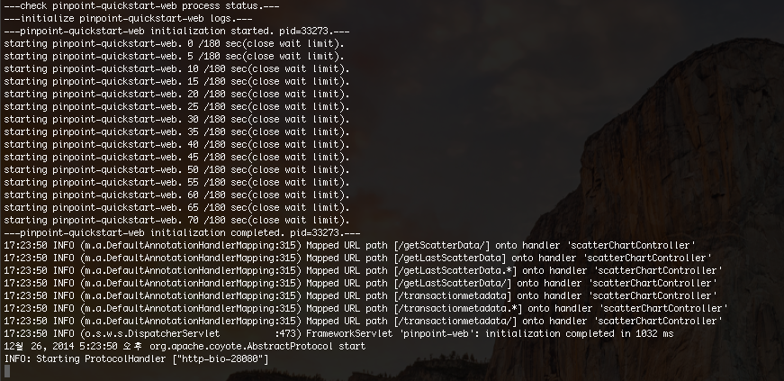

If you are using docker, [Take a look at pinpoint docker](./docker.html) which is the easiest way to look around.

You may run a sample Pinpoint instance in your own machine by running four simple scripts for each components: Collector, Web, Sample TestApp, HBase.

Once the components are running, you should be able to visit http://localhost:28080 to view the Pinpoint Web UI, and http://localhost:28081 to generate transactions on the Sample TestApp.

Pinpoint is comprised of 3 main components (Collector, Web, Agent), and uses HBase as its storage. Collector and Web are packaged as simple WAR files, and the Agent is packaged so that it may be attached to applications as a java agent.

Pinpoint QuickStart provides a sample TestApp for the Agent to attach itself to, and launches all three components using [Tomcat Maven Plugin](http://tomcat.apache.org/maven-plugin.html).

## Requirements
In order to build Pinpoint, the following requirements must be met:

* JDK 6 installed ([jdk1.6.0_45](http://www.oracle.com/technetwork/java/javase/downloads/java-archive-downloads-javase6-419409.html#jdk-6u45-oth-JPR) recommended)
* JDK 7 installed ([jdk1.7.0_80](http://www.oracle.com/technetwork/java/javase/downloads/java-archive-downloads-javase7-521261.html#jdk-7u80-oth-JPR) recommended)
* JDK 8 installed
* JDK 9 installed
* JAVA_HOME environment variable set to JDK 8 home directory.
* JAVA_6_HOME environment variable set to JDK 6 home directory.
* JAVA_7_HOME environment variable set to JDK 7 home directory.
* JAVA_8_HOME environment variable set to JDK 8 home directory.
* JAVA_9_HOME environment variable set to JDK 9 home directory.

QuickStart supports Linux, OSX, and Windows.

## Starting 
Download Pinpoint with `git clone https://github.com/naver/pinpoint.git` or [download](https://github.com/naver/pinpoint/archive/master.zip) the project as a zip file and unzip.

Install Pinpoint by running `./mvnw install -DskipTests=true`

### Install & Start HBase

The following script downloads HBase standalone from [Apache download site](http://apache.mirror.cdnetworks.com/hbase/).

> **For Windows**, you'll have to download HBase manually from [Apache download site](http://apache.mirror.cdnetworks.com/hbase/).
> 
> Download `HBase-1.0.3-bin.tar.gz` and unzip it.
> 
> Rename the directory to `hbase` so that the final HBase directory looks like `quickstart\hbase\hbase`.
> 
> Also note that you should run the scripts below by their corresponding `.cmd` files.

**Download & Start** - Run `quickstart/bin/start-hbase.sh`

**Initialize Tables** - Run `quickstart/bin/init-hbase.sh`

### Start Pinpoint Daemons

**Collector** - Run `quickstart/bin/start-collector.sh`

**TestApp** - Run `quickstart/bin/start-testapp.sh`

**Web UI** - Run `quickstart/bin/start-web.sh`

Once the startup scripts are completed, the last 10 lines of the Tomcat log are tailed to the console:

**Collector**

**TestApp**

**Web UI**

### Check Status
Once HBase and the 3 daemons are running, you may visit the following addresses to test out your very own Pinpoint instance.

* Web UI - http://localhost:28080
* TestApp - http://localhost:28081

You can feed trace data to Pinpoint using the TestApp UI, and check them using Pinpoint Web UI. TestApp registers itself as *test-agent* under *TESTAPP*.

## Stopping

**Web UI** - Run `quickstart/bin/stop-web.sh`

**TestApp** - Run `quickstart/bin/stop-testapp.sh`

**Collector** - Run `quickstart/bin/stop-collector.sh`

**HBase** - Run `quickstart/bin/stop-hbase.sh`

## Extra

Pinpoint Web uses Mysql to persist users, user groups, and alarm configurations. 
However Quickstart uses MockDAO to reduce memory usage. 
Therefore if you want to use Mysql for Quickstart, please refer to Pinpoint Web's [applicationContext-dao-config.xml](https://github.com/naver/pinpoint/blob/master/web/src/main/resources/applicationContext-dao-config.xml), [jdbc.properties](https://github.com/naver/pinpoint/blob/master/web/src/main/resources/jdbc.properties).

Additionally, if you would like to enable alerts, you need to implement additional logic. Please ref this [link](./alarm.html)
